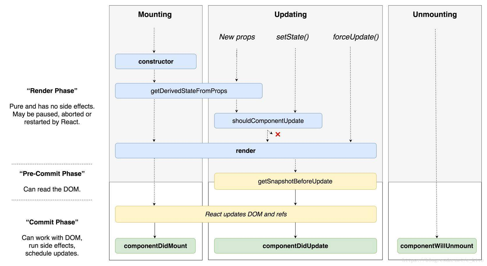

## 生命周期


react 生命周期分为三个阶段： 挂载阶段 更新阶段 卸载阶段

以ClassComponent 为例 

```javascript
class ClassComponent extends Component {
  constructor(props) {
    super(props);
    this.state = {};
  }

  componentDidMount() {}
    
  render() {
    return (
      <div>
       	classComponent
      </div>
    );
  }
}
```
### 挂载时的执行顺序是 
1. constructor(props, context)
2. static getDerivedStateFromProps(props, status)
3. render()
4. componentDidMount()

在 [ReactFiberBeginWork.old.js](https://github.com/facebook/react/blob/master/packages/react-reconciler/src/ReactFiberBeginWork.old.js) 中 有关classcomponent 的 部分代码如下, 可以看出  初次挂载时， **instance === null** 所以会先执行constructClassInstance 方初始化组件，接着执行mountClassInstance 方法挂载组件实例，初次执行时shouldUpdate 设置为true，让react 进行render, 后续更新state 或者 props 是否render是根据 updateClassInstance方法 返回值赋值给shouldUpdate 变量进行判断，操作classComponent的方法都在[ReactFiberClassComponent.old.js](https://github.com/facebook/react/blob/master/packages/react-reconciler/src/ReactFiberClassComponent.new.js)中


```javascript
//  ReactFiberBeginWork.old.js 
function updateClassComponent(
  current: Fiber | null,
  workInProgress: Fiber,
  Component: any,
  nextProps,
  renderExpirationTime: ExpirationTime,
) {
  let hasContext;
  if (isLegacyContextProvider(Component)) {
    hasContext = true;
    pushLegacyContextProvider(workInProgress);
  } else {
    hasContext = false;
  }
  prepareToReadContext(workInProgress, renderExpirationTime);

  const instance = workInProgress.stateNode;
  let shouldUpdate;
  if (instance === null) {
    if (current !== null) {
      // A class component without an instance only mounts if it suspended
      // inside a non-concurrent tree, in an inconsistent state. We want to
      // treat it like a new mount, even though an empty version of it already
      // committed. Disconnect the alternate pointers.
      current.alternate = null;
      workInProgress.alternate = null;
      // Since this is conceptually a new fiber, schedule a Placement effect
      workInProgress.effectTag |= Placement;
    }
    // In the initial pass we might need to construct the instance.
    constructClassInstance(workInProgress, Component, nextProps);
    mountClassInstance(
      workInProgress,
      Component,
      nextProps,
      renderExpirationTime,
    );
    shouldUpdate = true;
  } else if (current === null) {
    // In a resume, we'll already have an instance we can reuse.
    shouldUpdate = resumeMountClassInstance(
      workInProgress,
      Component,
      nextProps,
      renderExpirationTime,
    );
  } else {
    shouldUpdate = updateClassInstance(
      current,
      workInProgress,
      Component,
      nextProps,
      renderExpirationTime,
    );
  }
  const nextUnitOfWork = finishClassComponent(
    current,
    workInProgress,
    Component,
    shouldUpdate,
    hasContext,
    renderExpirationTime,
  );
  if (__DEV__) {
    const inst = workInProgress.stateNode;
    if (shouldUpdate && inst.props !== nextProps) {
      if (!didWarnAboutReassigningProps) {
        console.error(
          'It looks like %s is reassigning its own `this.props` while rendering. ' +
            'This is not supported and can lead to confusing bugs.',
          getComponentName(workInProgress.type) || 'a component',
        );
      }
      didWarnAboutReassigningProps = true;
    }
  }
  return nextUnitOfWork;
}
```
```javascript
//  ReactFiberClassComponent.old.js
/*
	在mountClassInstance方法中  会判断实例上是否有 getDerivedStateFromProps， 有的话执行
*/
const getDerivedStateFromProps = ctor.getDerivedStateFromProps;
  if (typeof getDerivedStateFromProps === 'function') {
    applyDerivedStateFromProps(
      workInProgress,
      ctor,
      getDerivedStateFromProps,
      newProps,
    );
    instance.state = workInProgress.memoizedState;
  }
```

### 更新阶段的执行顺序是

1. static getDerivedStateFromProps(props, status)
2. shouldComponentUpdate(nextProps, nextState, nextContext)
3. render
4. getSnapshotBeforeUpdate(prevProps, prevState)
5. componentDidUpdate(prevProps, prevState, snapshot)

```
// 在给shouldUpdate 赋值时调用的函数中 有用到checkShouldComponentUpdate 这个方法， 在判断instance 上有shouldComponentUpdate 方法时 执行 shouldComponentUpdate 方法
function checkShouldComponentUpdate(
  workInProgress,
  ctor,
  oldProps,
  newProps,
  oldState,
  newState,
  nextContext,
) {
  const instance = workInProgress.stateNode;
  if (typeof instance.shouldComponentUpdate === 'function') {
    if (__DEV__) {
      if (
        debugRenderPhaseSideEffectsForStrictMode &&
        workInProgress.mode & StrictMode
      ) {
        disableLogs();
        try {
          // Invoke the function an extra time to help detect side-effects.
          instance.shouldComponentUpdate(newProps, newState, nextContext);
        } finally {
          reenableLogs();
        }
      }
    }
    const shouldUpdate = instance.shouldComponentUpdate(
      newProps,
      newState,
      nextContext,
    );

    if (__DEV__) {
      if (shouldUpdate === undefined) {
        console.error(
          '%s.shouldComponentUpdate(): Returned undefined instead of a ' +
            'boolean value. Make sure to return true or false.',
          getComponentName(ctor) || 'Component',
        );
      }
    }

    return shouldUpdate;
  }

  if (ctor.prototype && ctor.prototype.isPureReactComponent) {
    return (
      !shallowEqual(oldProps, newProps) || !shallowEqual(oldState, newState)
    );
  }

  return true;
}
```
